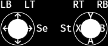
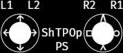
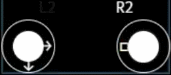
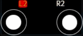

# Game Pad Viewer

Simple gamepad input overlay for streaming.

Width and height for the viewer is 178x77.  
Press any key on the gamepad after plugging it in and the viewer will start showing the buttons.
