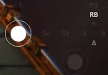

# Xbox Pad viewer

Simple Xbox gamepad tracker for use with [OBS](https://obsproject.com) streaming.

## Setup
Download the files as ZIP and extract it.  
These files are essential, keep them in the same place: `xboxpadviewer.html`, `mapping.css`, `options.js`, `dot.png`.  
You can make changes on colors, fade-out times, etc. in `options.js`.

Or, without downloading any files you can just load [the hosted html page](https://dinir.github.io/xbox-pad-viewer/xboxpadviewer.html) directly from OBS.

Width and height for one gamepad to display is 220x156.  
Press any key on the gamepad and the viewer will show the buttons.

### Windows
Add a browser source and set it to load the html file.

### Linux
Open the html file and click 'Open in new window' button to open the same page in a small window.  
Add a window capture and set it to capture the small window.  
Crop the edges properly.

## Tested with
Xbox Controller (360, One), DualShock4  
Windows 8.1, Windows 10, ArchLinux  
Chrome

- - -
ⓒ 2017 Dinir Nertan, [@DinirNertan](https://twitter.com/DinirNertan), DinirNertan@gmail.com  
   Use it freely, just don't delete my name on the code.
